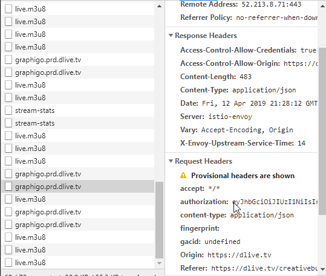

# DLive Chat Bot, A Desktop App For Chat

### Description

This chat bot allows you to entirely custom code your own bot how you see fit and interact with the private DLive Chat API.

It is currently in heavy early stage development with tons of new features being added daily! (Support me and my journey, and check for future updates on my dlive channel!)[https://dlive.tv/creativebuilds]

Currently it is only for people who know how to run node / have some basic understanding on how javascript works.

### Installation Process

 1. Make sure you have Node 8 or greater installed, you can find that [here](https://nodejs.org/en/download/)
 2. Download this repo using the github client or by zipping it.
 3. After you have the all the files downloaded, navigate to the directory and type `npm i` this will install all needed modules.
 4. Once `npm i` has finished installing it's time to setup the config!
 5. First rename the `config.template.js` to `config.js` then set your streamername **Note the streamername is the name of the streamer's chat you want to connect to** as your name on the **LINO BLOCKCHAIN** This is not necesarily the same name you have on dlive! You can check it by navigating to the `earnings` tab on your stream page. Example: https://dlive.tv/creativebuilds 
 6. Once you've set your streamername as your blockchain username found in step 5, you're going to need to find an authKey  **Note if you're using a separate account for a bot (recommended, sign into this account now!)**. This is pretty tricky, and not for normal users *(this is why I said you have to know something about how web dev works)* 
 7.  Open a url to your stream or any page where you can send chat messages.
 8. Open the dev console *(note I will be walking through this process on chrome)* for chrome do `ctrl + shift + j`
 9. Once open, look at the top of the developer console and navigate to the `Network` tab 
 10. With that tab open send a message in chat, doesn't need to be anything specific and you should see two new requests in that panel labeled `graphigo.prd.dli...` I wont get into the specifics of what these are, but basically it tells the server who you are and what message you would like to send.
 11. Click on the bottom `graphigo.prd.dli...` and you should be greeted with a page something like this 
 12.  Copy the string of text next to the header called `authorization` it should be pretty long *(this string is found right where my cursor is in the image)*
 13.  Paste this string inside the `config.js` file from earlier as your authKey 
 14. Add your discord invite, if you want to be able to invite people to discord with the bot (not needed)
 15. Open a console to this directory, to do this on windows hit the `Windows Home Key + r` then type cmd and hit enter
 16. Now that you have a console open navigate to the directory by doing `cd C://path/to/where/you/downloaded/this/project` 
 17. After you're in the directory inside of a terminal, run the command `electron .` this will open a desktop app and should automatically log you in and listen to chat! 
