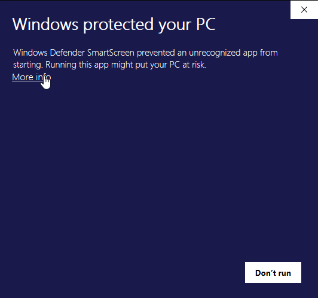

# DLive Chat Bot, A Desktop App For Chat

### Description

This chat bot allows you to entirely custom code your own bot how you see fit and interact with the private DLive Chat API.

It is currently in heavy early stage development with tons of new features being added daily! [Support me and my journey, and check for future updates on my dlive channel!](https://dlive.tv/creativebuilds)

Currently it is only for people who know how to run node / have some basic understanding on how javascript works.

### Installation Process

1.  Download the latest release [here](https://github.com/CreativeBuilds/dlive-chat-bot/releases)
2.  Run the exe and click the text that says `more info` and then `run anyway` *the reason this screen comes up is because I am currently an 'unknown publisher' but I am looking into how to fix this!*
3.  After the install is completed and you launch the application, enter your stream username, then your authorization key from DLive.
